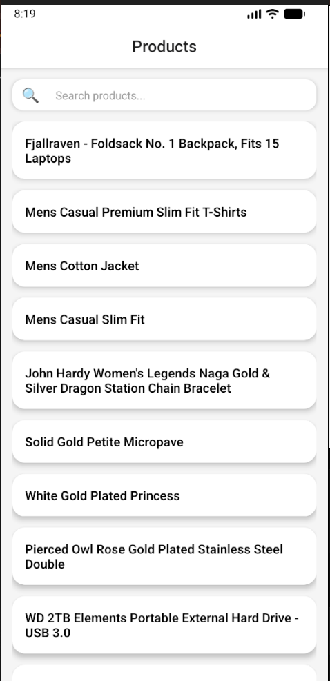

# Product Explorer App

This is a simple React Native mobile application to browse and search products.

## Features

* Search products
* Clean UI
* Product listing from API
* Smooth scrolling using FlatList
* State management using Redux Toolkit

## Tech Stack

* React Native
* TypeScript
* Redux Toolkit
* React Navigation

## Project Structure

```
src/
 ├── components/
 ├── screens/
 ├── redux/
 └── services/
```
## Screenshots


## Installation

1. Clone the repository

```
git clone https://github.com/harshitha2102/ProductExplorer.git
```

2. Go to project folder

```
cd ProductExplorer
```

3. Install dependencies

```
npm install
```

4. Run the app

```
npx react-native run-android
```

## Future Improvements

* Add favorites feature
* Add cart functionality
* Improve product details screen

## Author

Harshitha Pusala
